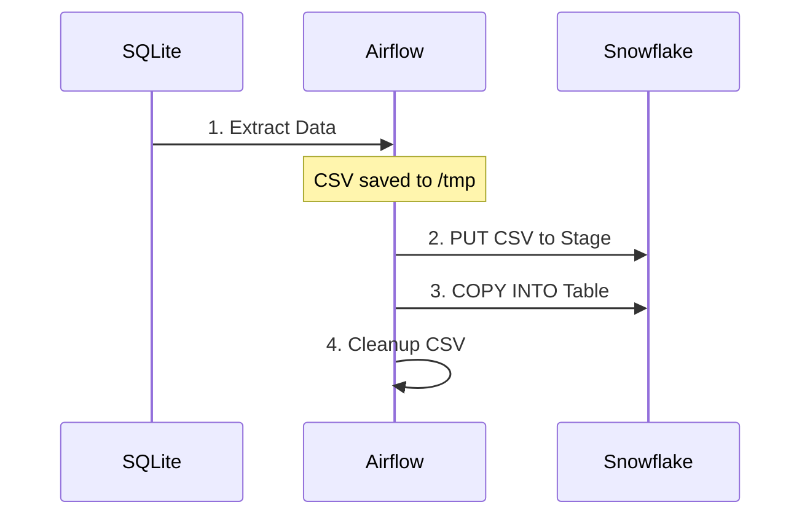

# SQLite to Snowflake Data Pipeline with Airflow


A robust data pipeline that extracts data from a SQLite database and loads it into Snowflake using Apache Airflow, containerized with Docker.

---

## Table of Contents
- [Architecture](#architecture)
- [Prerequisites](#prerequisites)
- [Setup Guide](#setup-guide)
- [Pipeline Workflow](#pipeline-workflow)
- [DAG Structure](#dag-structure)
- [Troubleshooting](#troubleshooting)
- [Future Improvements](#future-improvements)

---

## Architecture

### Flow Diagram



**Key Components**:
1. **SQLite**: Source database containing the `customers` table
2. **Airflow**: Orchestrates extraction and loading
3. **Snowflake**: Destination data warehouse

---

## Prerequisites

### Tools
- Docker & Docker Compose
- Snowflake Account
- SQLite3 (for local testing)

### Snowflake Setup
1. Create the target table:
    ```sql
    CREATE TABLE customers (
        id INTEGER PRIMARY KEY,
        name TEXT NOT NULL,
        email TEXT UNIQUE NOT NULL,
        age INTEGER,
        created_at TIMESTAMP DEFAULT CURRENT_TIMESTAMP
    );
    ```
2. Ensure user `your_user` has:
   - `USAGE` on warehouse `your_snowflake_warehouse`
   - `INSERT` privileges on `your_snowflake_database`

---

## Setup Guide

### 1. Clone Repository
```bash
git clone https://github.com/waitambatha/sqlite-to-snowflake.git
cd sqlite-to-snowflake
```

### 2. Prepare SQLite Data
Place your SQLite database file in `dags/`:
```bash
cp path/to/your/data_source.db dags/
```

### 3. Configure Airflow Connection
1. Start Airflow:
    ```bash
    docker-compose up -d
    ```
2. Access Airflow UI at `http://localhost:8080`
3. Configure Snowflake connection:
   - **Conn Id**: `your conn id`
   - **Conn Type**: Snowflake
   - **Host**: `your_snowflake_host`
   - **Schema**: `your_ab_schema`
   - **Login**: `your_logging_username`
   - **Password**: `your_password`
   - **Extra**: `{"warehouse": your_warehouse"}`


### 4. Build Custom Docker Image
Create `Dockerfile`:
```dockerfile
FROM apache/airflow:2.5.0
RUN pip install apache-airflow-providers-snowflake pandas
```

Update `docker-compose.yml`:
```yaml
services:
  webserver:
    build: .
    # ... rest of config
```

---

## Pipeline Workflow

### 1. Extraction Phase
- **Input**: `data_source.db` (SQLite)
- **Process**:
  - Connect to SQLite database
  - Query `customers` table
  - Export to CSV at `/tmp/sqlite_data.csv`
- **Validation**:
  ```bash
  docker exec -it airflow-webserver bash
  head /tmp/sqlite_data.csv
  ```

### 2. Loading Phase
- **Operations**:
  1. `PUT`: Upload CSV to Snowflake internal stage
  2. `COPY INTO`: Load data from stage to table
- **Snowflake Query**:
  ```sql
  SELECT COUNT(*) FROM AB_DATABASE.customers;
  ```

### 3. Cleanup Phase
- Automatically removes temporary CSV file

---

## DAG Structure

### Tasks Overview
```python
with DAG(...) as dag:
    extract = PythonOperator(task_id="extract_sqlite_data", ...)
    load = PythonOperator(task_id="load_data_to_snowflake", ...)
    extract >> load
```

### Key Features
- **Error Handling**: Automatic retries with exponential backoff
- **Idempotency**: Can be rerun safely without duplicates
- **Logging**: Detailed task logs in Airflow UI

---

## Troubleshooting

### Common Issues

| Symptom | Solution |
|---------|----------|
| `snowflake_ab` connection not found | Verify connection name and parameters in Airflow UI |
| CSV file not created | Check SQLite file exists in `dags/` directory |
| Permission denied in Snowflake | Validate user privileges on warehouse and table |
| Data type mismatches | Ensure SQLite and Snowflake schemas match |

### Debugging Tips
1. Check task logs in Airflow UI
2. Validate CSV format:
    ```bash
    docker exec airflow-webserver cat /tmp/sqlite_data.csv
    ```
3. Test Snowflake connection manually:
    ```python
    hook = SnowflakeHook(snowflake_conn_id="snowflake_ab")
    hook.get_conn().cursor().execute("SELECT 1")
    ```

---

## Future Improvements

1. **Data Validation**:
   - Add Great Expectations checks
   - Implement row count verification

2. **Enhanced Error Handling**:
   - Slack notifications on failure
   - Dead-letter queue for bad records

3. **Performance**:
   - Parallel data loading
   - Incremental loads with CDC

4. **Monitoring**:
   - Data quality dashboards
   - Airflow performance metrics

---
